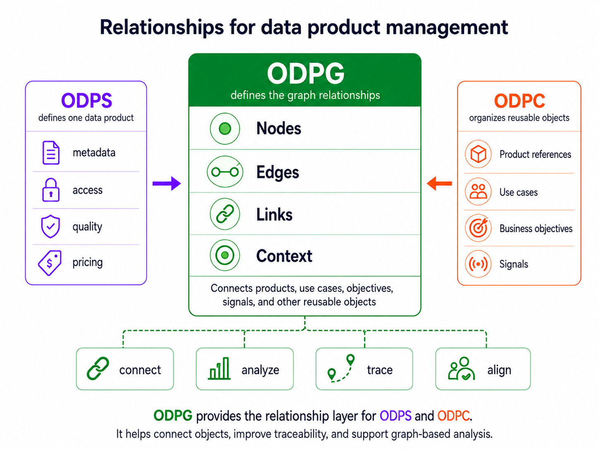

# Open Data Product Graphs

<p align="center">
  
</p>

<p align="center">
  <strong>A vendor-neutral, machine-readable graph model for connecting data products, use cases, objectives, KPIs, policies, APIs, agents, and business value.</strong>
</p>

<p align="center">
  <a href="https://www.apache.org/licenses/LICENSE-2.0"></a>
  
  
  
</p>

---

## What Is ODPG?

Open Data Product Graphs (ODPG) is the relationship and intelligence layer of the Open Data Products ecosystem. It gives organizations a standard way to describe how enterprise assets connect across strategy, governance, semantics, operations, and AI-assisted reasoning.

ODPG helps answer questions such as:

- Which data products support a business objective?
- Which use cases depend on a data product, API, workflow, or agent?
- Which KPIs measure strategic outcomes?
- Which policies govern downstream assets?
- Where are strategic gaps, overlaps, or unsupported objectives?
- What trusted graph context should an AI agent use before acting?

## Why It Matters

Modern data ecosystems are distributed across catalogs, platforms, teams, policies, agents, APIs, and business domains. ODPG connects those fragments into a graph-native structure that is readable by humans, software, and AI systems.

| Capability | What ODPG Enables |
| --- | --- |
| Strategic alignment | Link use cases, data products, KPIs, and objectives |
| Governance reasoning | Trace policy relationships across connected assets |
| Impact analysis | Follow dependencies and relationship paths |
| AI grounding | Provide trusted graph context for agents and automation |
| Interoperability | Reference ODPS, ODPV, ODPC, and external graph formats |
| Visualization | Generate graph explorer views for inspection and review |

## Repository Contents

| Path | Purpose |
| --- | --- |
| `source/index.html.md` | Main human-readable ODPG specification |
| `source/includes/` | Specification sections rendered into the docs site |
| `source/schema/odpg.yaml` | YAML schema for ODPG graph validation |
| `source/schema/odpg.json` | JSON schema for ODPG graph validation |
| `source/graph/objects.jsonl` | Agent-friendly graph resource for retrieval and reasoning |
| `source/examples/` | Example ODPG graphs and related assets |
| `source/scripts/` | Python toolkit for validation, conversion, traversal, analysis, and visualization |
| `tests/` | Pytest coverage for the shared toolkit logic |
| `build/` | Generated static documentation output |

## Quick Start

Clone the repository and install the documentation dependencies:

```bash
git clone https://github.com/Open-Data-Product-Initiative/odpg-v1.0.git
cd odpg-v1.0
bundle install
```

Run the local documentation site:

```bash
bundle exec middleman serve
```

Open the docs at:

```text
http://localhost:4567
```

Build the static site:

```bash
bundle exec middleman build
```

## Python Toolkit

Install development dependencies:

```bash
python -m pip install -r requirements-dev.txt
```

Validate an ODPG graph:

```bash
python source/scripts/odpg_validate.py -i source/examples/SLA/sla.yml
```

Convert an external graph format into ODPG YAML:

```bash
python source/scripts/odpg_convert.py -i path/to/source.graphml -o graph.yml
```

Summarize graph metadata, nodes, edges, and confidence values:

```bash
python source/scripts/odpg_summary.py -i graph.yml
```

Traverse relationships from a starting node:

```bash
python source/scripts/odpg_traverse.py -i graph.yml --start DP-001 --depth 2
```

Analyze governance and strategic gaps:

```bash
python source/scripts/odpg_analyze.py -i graph.yml
```

Extract trusted context around a node for AI-agent use:

```bash
python source/scripts/odpg_agent_context.py -i graph.yml --node AGENT-001 --depth 2
```

Generate a standalone graph explorer:

```bash
python source/scripts/generate_graph_explorer.py -i graph.yml -o graph-explorer.html
```

[](source/graph/examples/graph-explorer.html)

## Minimal Graph Example

```yaml
schema: https://opendataproducts.org/odpg-v1.0/schema/odpg.yaml
version: "1.0"
kind: Graph
graph:
  metadata:
    id: GRAPH-EXAMPLE-001
    name:
      en: Example Data Product Graph
    description:
      en: A simple graph connecting a use case, data product, KPI, and objective.
  nodes:
    - id: UC-001
      type: UseCase
      $ref: ../usecases/customer-retention.yaml
    - id: DP-001
      type: DataProduct
      $ref: ../products/customer-360.yaml
    - id: KPI-001
      type: KPI
      $ref: ../kpis/churn-rate.yaml
    - id: OBJ-001
      type: BusinessObjective
      $ref: ../objectives/reduce-churn.yaml
  edges:
    - from: UC-001
      to: DP-001
      type: uses
      confidence: high
    - from: DP-001
      to: KPI-001
      type: tracks
      confidence: medium
    - from: KPI-001
      to: OBJ-001
      type: measures
      confidence: high
```

## Testing

Run the Python toolkit test suite:

```bash
python -m pytest tests/test_odpg_toolkit.py
```

The tests cover validation, invalid edge handling, graph summaries, relationship traversal, strategic and governance analysis, AI-agent context extraction, and JSON output writing.

## Docker

Build and run the documentation site with Docker:

```bash
docker build -t odpg-docs .
docker run --rm -p 4567:4567 odpg-docs serve
```

Build the static documentation output:

```bash
docker run --rm -v "${PWD}/build:/srv/slate/build" odpg-docs build
```

## Relationship to the Open Data Products Family

| Specification | Role |
| --- | --- |
| ODPS | Defines the structure and metadata of a data product |
| ODPV | Defines shared vocabulary and semantic meaning |
| ODPC | Defines catalog interoperability and discovery structures |
| ODPG | Defines graph relationships between data products, use cases, objectives, policies, agents, and related entities |

ODPG should reference full data product metadata rather than copying it. Use ODPS for detailed product metadata, ODPV for stable vocabulary and semantics, ODPC for discovery catalogs, and ODPG for graph relationships, traversal, governance propagation, and strategic reasoning.

## Contributing

Contributions are welcome through issues and pull requests. Useful contribution areas include:

- Specification clarifications and examples
- Schema improvements
- Toolkit enhancements
- Additional graph format converters
- Validation and analysis rules
- Documentation and visual explorer improvements

Please follow the repository code of conduct and keep changes focused, testable, and aligned with the ODPG graph model.

## License

This project is licensed under the [Apache License 2.0](LICENSE).

Development of the specification is under the umbrella of the Linux Foundation.
